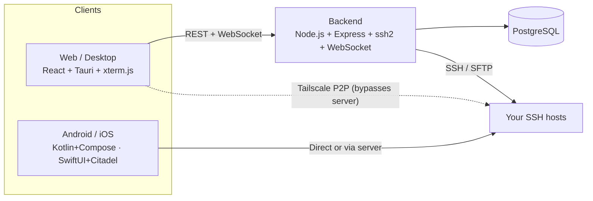

<div align="center">

# NovoSSH Community Edition

**Your infrastructure, one terminal.**

The open source, self-hostable core of [NovoSSH](https://novossh.com) — a modern SSH terminal client with Tailscale-native connectivity, an encrypted vault, and team collaboration.

[](https://github.com/incnovoconsulting-cpu/novossh-ce/actions/workflows/ci.yml)
[](LICENSE)
[](CONTRIBUTING.md)
[](package.json)
[](#self-hosting-quick-start)

[Quick Start](#self-hosting-quick-start) ·
[Features](#features) ·
[Architecture](#architecture) ·
[Contributing](#contributing) ·
[Security](#security)

</div>

---

## About this repository

NovoSSH Community Edition (`novossh-ce`) is the open source counterpart to the hosted [novossh.com](https://novossh.com) service. It contains the full web app, backend server, desktop (Tauri), Android, and iOS clients, licensed under **AGPL-3.0** so you can self-host it, audit it, and modify it.

| | |
|---|---|
| **License** | AGPL-3.0 |
| **Requires an account or license key?** | No |
| **Platforms** | Web, Windows, Linux, macOS, Android, iOS |
| **Hosted alternative** | [novossh.com](https://novossh.com) — managed infra, support, billing |

novossh.com itself remains a separately operated hosted product (managed infrastructure, support, and billing on top of this codebase) — using this repository does not require an account, a license key, or a novossh.com subscription. Anything you self-host is entirely yours to run.

## Features

<table>
<tr><td valign="top" width="50%">

**SSH Terminal**
- Interactive shell with xterm.js and full PTY support
- Multi-tab sessions with split view
- Broadcast mode — type on multiple hosts simultaneously
- Command palette for quick actions
- Session recording and playback

**Connection Methods**
- **Tailscale P2P** — direct peer-to-peer SSH through WireGuard, no relay server
- **Server Relay** — route through your own NovoSSH server (works in browsers)
- **Direct** — connect to any publicly reachable host
- **SSH Certificates** — CA-signed key authentication on all platforms

</td><td valign="top" width="50%">

**File Transfer & Port Forwarding**
- **SFTP Browser** — upload, download, rename, create folders
- **Local Port Forwarding** (`-L`) — tunnel local port to remote service
- **Remote Port Forwarding** (`-R`) — expose local service on remote server
- **SOCKS5 Proxy** (`-D`) — route any traffic through SSH tunnel

**Security & Collaboration**
- **End-to-end encrypted vault** — passwords, SSH keys, and notes
- **Team management** — shared vaults, organizations, role-based access
- **Audit logs** — track all connections and commands
- **WebAuthn / 2FA** — hardware key and TOTP support
- **Biometric lock** — fingerprint/face unlock on mobile

</td></tr>
</table>

**Developer Experience** — snippets to save and run frequent commands across hosts, an SSH config parser that imports hosts from `~/.ssh/config`, a full keyboard-driven command palette, and custom terminal themes (Novo Dark, Dracula, Solarized, and more).

---

## Architecture



| Layer | Tech | Path |
|---|---|---|
| Frontend | React 18, Vite, Tailwind CSS, xterm.js | `src/` |
| Backend | Node.js, Express, ssh2, WebSocket | `server/` |
| Desktop | Tauri v2, Rust (ssh2 crate) | `tauri/` |
| Android | Kotlin, Jetpack Compose, JSch | `android/` |
| iOS | SwiftUI, Citadel SSH library | `ios/` |
| Deployment | Docker, Kubernetes, Cloudflare Worker | `k8s/`, `infrastructure/`, `workers/` |

Database is PostgreSQL. Optional integrations (Stripe billing, Apple/Google IAP, SAML/SSO, PostHog analytics) are present in the codebase but entirely opt-in — none of them are required to run a self-hosted instance.

---

## Self-Hosting Quick Start

**Prerequisites:** Node.js 20+, PostgreSQL, and Docker if you want the container path.

**Run from source**
```bash
git clone https://github.com/incnovoconsulting-cpu/novossh-ce.git
cd novossh-ce
npm install
cp .env.example .env   # fill in DATABASE_URL, JWT_SECRET, etc.
npm run dev             # starts web (Vite) + API concurrently
```

**Run with Docker**
```bash
cp .env.production.example .env
docker compose -f docker-compose.prod.yml up --build
```

**Deploy to Kubernetes**
Manifests are provided in [`k8s/`](k8s/) and [`infrastructure/k8s/`](infrastructure/k8s/) — copy the secrets templates, fill in your own values, and `kubectl apply`. See [`monitoring/`](monitoring/) for optional Prometheus/Grafana setup.

**Desktop builds**
```bash
npm run tauri:dev      # desktop dev build (Tauri)
npm run tauri:build    # production desktop build
```

Mobile clients live in [`android/`](android/) and [`ios/`](ios/) and build with standard Gradle / Xcode toolchains respectively.

---

## Tech Stack

`React 18` `Vite` `Tailwind CSS` `xterm.js` `Zustand` `Tauri v2` `Rust` `Node.js` `Express` `ssh2` `WebSocket` `PostgreSQL` `Kotlin` `Jetpack Compose` `SwiftUI` `Citadel`

---

## Contributing

Contributions are welcome — see [CONTRIBUTING.md](CONTRIBUTING.md) for how to set up your environment, coding conventions, and the PR process. Please also read our [Code of Conduct](CODE_OF_CONDUCT.md).

## Security

Found a vulnerability? Please **do not open a public issue** — see [SECURITY.md](SECURITY.md) for how to report it responsibly.

## License

NovoSSH Community Edition is licensed under the [GNU Affero General Public License v3.0](LICENSE). In short: you're free to run, study, modify, and redistribute this software, including as a hosted service — but if you do run a modified version as a network service, you must make your modified source available to its users under the same license.

---

<div align="center">

**[Hosted version at novossh.com →](https://novossh.com)**

</div>
